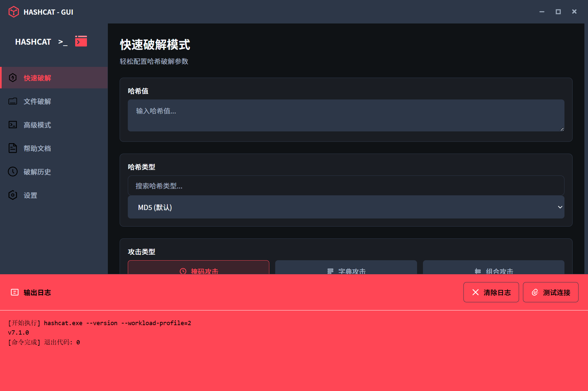

# Hashcat-GUI

一个现代化的Hashcat图形用户界面，让哈希破解变得简单直观。

## 项目概述

Hashcat-GUI是一个基于React和Tauri开发的跨平台图形界面工具，为命令行工具Hashcat提供了友好的用户交互界面。该工具支持多种哈希类型的识别、文件哈希提取、多种破解模式以及实时日志展示，让哈希破解过程更加便捷高效。

## 主要特性

### 核心功能
- **多模式支持**：提供快速破解、文件破解和高级模式三种工作流程
- **文件哈希提取**：支持从加密文件中自动提取哈希值
- **多种破解方式**：字典攻击、掩码攻击、组合攻击和自定义命令
- **实时日志展示**：支持命令执行过程的实时输出，自动滚动到最新内容
- **破解历史记录**：记录并展示历史破解任务

### 高级特性
- **性能优化设置**：工作负载配置、内核优化选择等
- **自定义参数**：支持添加额外的hashcat命令行参数

## 系统要求

### 基本要求
- **操作系统**：Windows 10/11、Ubuntu 20.04+、macOS 12+
- **内存**：至少4GB RAM
- **存储**：至少1GB可用空间
- **Node.js**：v16或更高版本
- **Rust**：1.63或更高版本（用于Tauri开发）

### 依赖工具
- **Hashcat**：最新稳定版本（推荐6.0+）
- **John the Ripper Jumbo**：用于文件哈希提取（可选，但推荐）

## 使用方法

### 初始设置

1. 启动应用后，首先在**设置**页面配置Hashcat路径
2. 可选：配置John the Ripper Jumbo路径以启用文件哈希提取功能
3. 根据需要调整性能设置

### 哈希破解流程

#### 1. 快速破解
- 在**快速破解**标签页中，输入哈希值
- 选择哈希类型（如果未自动识别）
- 选择攻击类型（字典、掩码或组合）
- 配置相应的参数（字典文件、掩码等）
- 点击**开始破解**按钮启动破解过程

#### 2. 文件破解
- 在**文件破解**标签页中，选择要破解的加密文件
- 点击**提取哈希**按钮
- 确认哈希类型和提取结果
- 选择攻击方法和相关参数
- 点击**开始破解**按钮

#### 3. 高级模式
- 在**高级模式**标签页中，输入完整的哈希值
- 选择哈希类型
- 配置自定义参数（如果需要）
- 点击**开始破解**按钮

## 功能详解

### 文件哈希提取

该功能支持从多种加密文件格式中提取哈希值：
- 优先使用专用工具（如rar2john）提取哈希
- 如果专用工具不可用，将尝试使用John the Ripper的通用方法
- 提取过程中会显示详细的调试信息和执行命令

### 实时日志展示

- 日志区域会实时显示命令执行输出
- 自动滚动到最新日志内容，确保用户始终能看到最新信息
- 支持清除日志和测试连接功能

## 技术栈

### 前端
- **React** - 用于构建用户界面
- **Vite** - 前端构建工具
- **CSS** - 样式设计

### 后端
- **Rust** - 系统级编程语言
- **Tauri** - 构建跨平台桌面应用的框架

### 外部工具
- **Hashcat** - 高性能密码恢复工具
- **John the Ripper** - 密码破解工具，用于文件哈希提取

## 故障排除

### 常见问题

1. **无法识别哈希类型**
   - 确保哈希值格式正确
   - 尝试手动指定哈希类型

2. **文件哈希提取失败**
   - 检查John the Ripper路径设置
   - 确保文件格式受支持
   - 查看调试信息了解详细错误原因

3. **hashcat执行错误**
   - 确认hashcat路径设置正确
   - 检查参数格式是否有效
   - 查看输出日志获取详细错误信息

## 贡献指南

欢迎提交问题报告、功能建议和代码贡献！

### 提交代码

1. Fork 本仓库
2. 创建特性分支 (`git checkout -b feature/amazing-feature`)
3. 提交更改 (`git commit -m 'Add some amazing feature'`)
4. 推送到分支 (`git push origin feature/amazing-feature`)
5. 打开Pull Request

## 许可证

本项目采用MIT许可证。详情请参阅LICENSE文件。

## 免责声明

本工具仅用于合法的安全测试和授权的渗透测试。请确保您在使用本工具时遵守所有适用的法律法规。作者不对任何非法使用承担责任。
